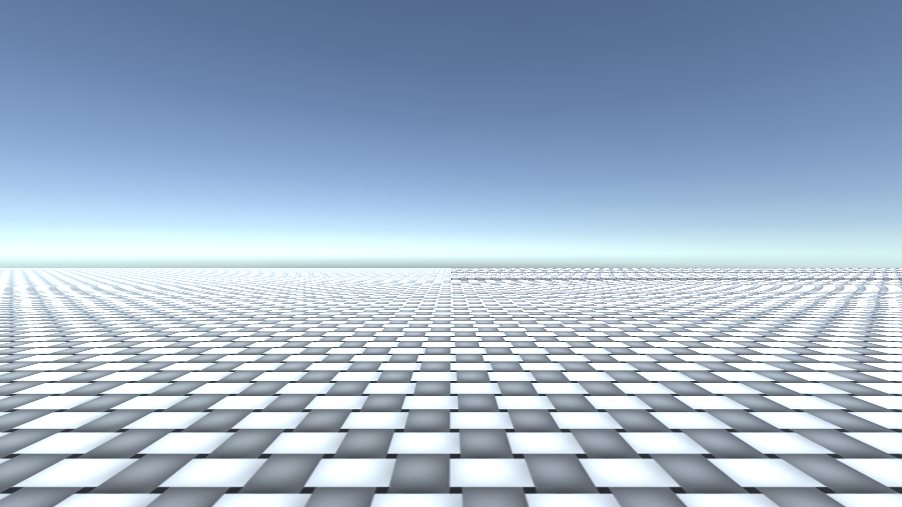
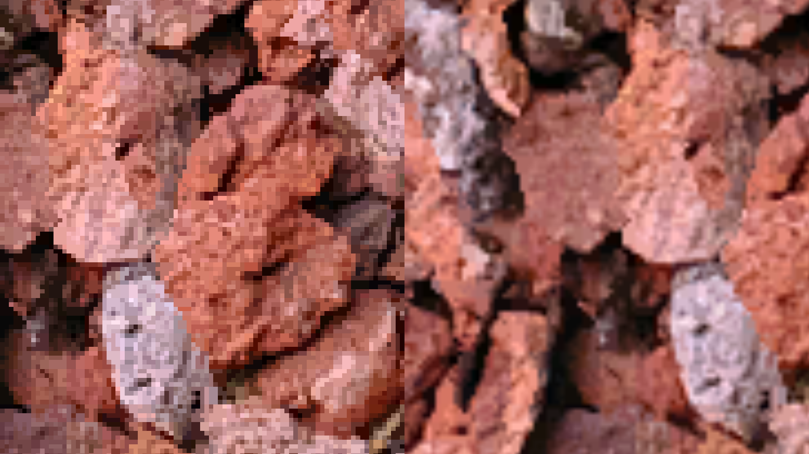
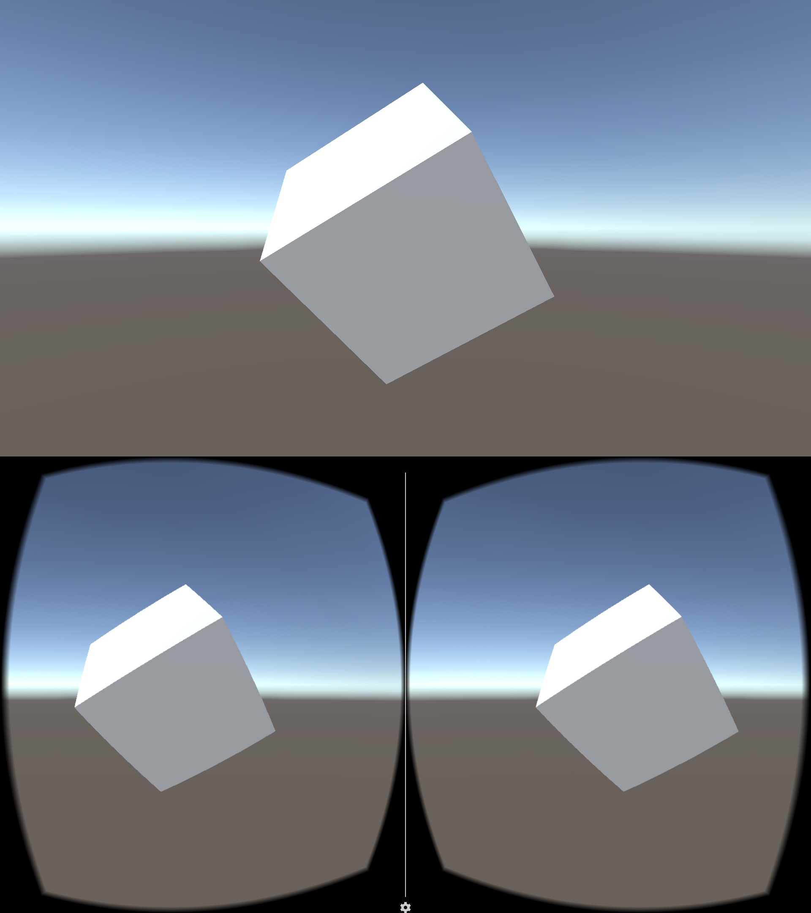

# Visual artifacts of realtime rendering systems

This is a collection of effects resulting by the design of realtime rendering systems and appropriate solutions to these issues. 

## Aliasing - Antialiasing

*Problem:* Aliasing of polygonal edges

*Solution:* Subpixel Morphologic Anti-Aliasing

## Minification/Moire and much more - Mipmaps

*Problem:* Variing texture sharpness with magnification/minification as well as moire effects

*Solution:* Mipmaps. Generate multiple versions with different resolution of one texture

  

## Pixelation of Textures - Texture filtering

*Problem:* Magnified Textures will generate a pixellated look. 

*Solution:* Filtering textures will smooth out pixelation. 

## Perspective distortion - 2D Projection/ stereoscopic project with lens distortion

*Problem:* Objects further aways from the viewer appear smaller than those closer
*Solution:* Projects these objects from 3D space to a 2D Image using a projection matrix [http://www.songho.ca/opengl/gl_projectionmatrix.html](http://www.songho.ca/opengl/gl_projectionmatrix.html). 
*Solution:* For VR: Compensate for lens distortion with fresnel lenses in VR Headsets as well. Display stereoscopic split-view. 

